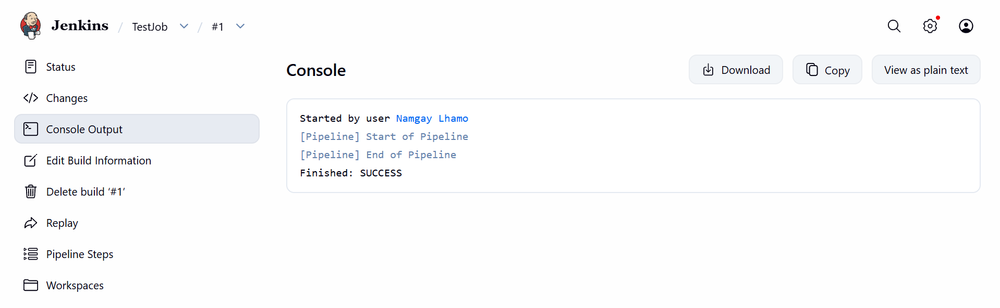
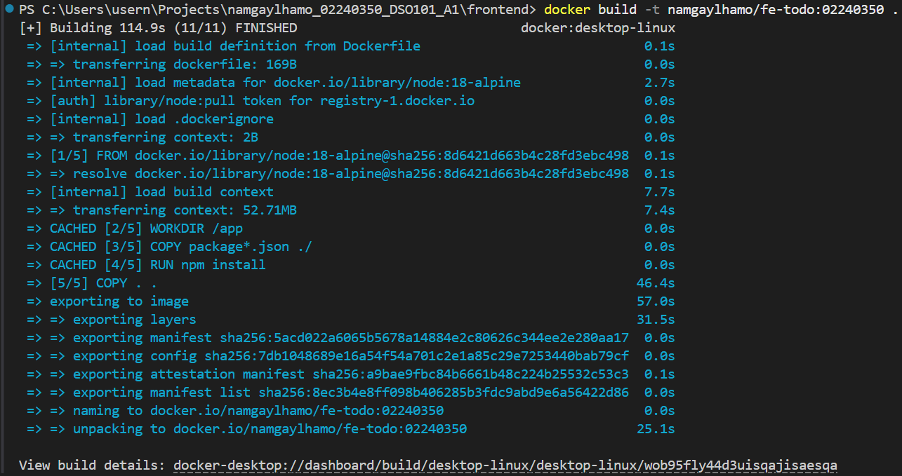
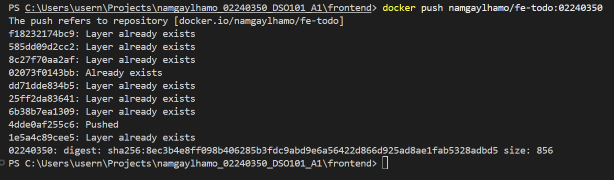
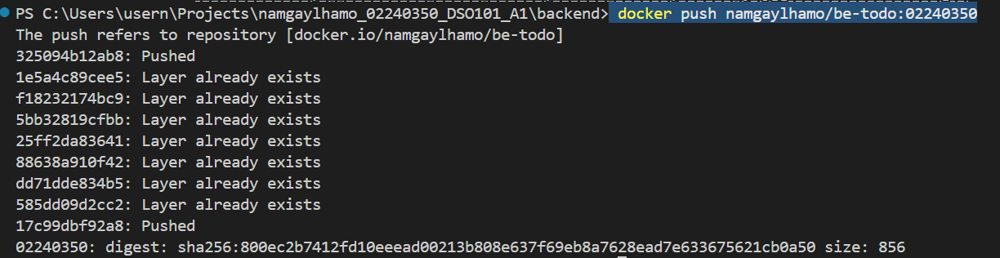
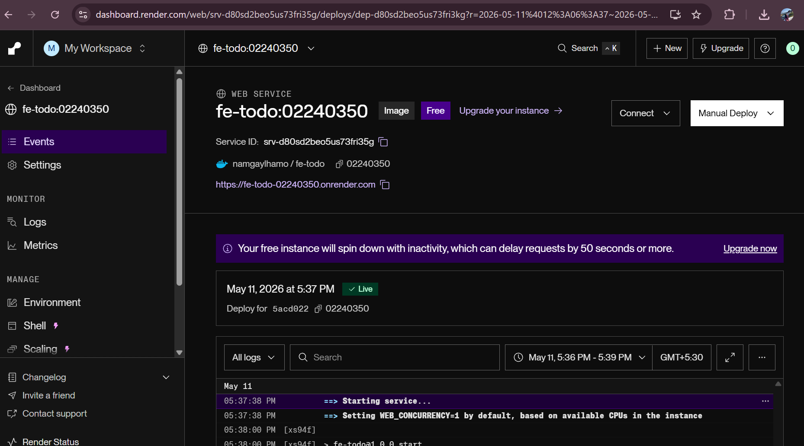
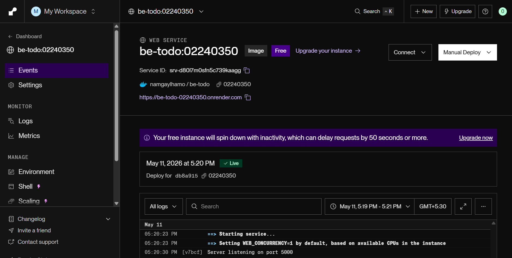

# Assignment 1 — To‑Do App Deployment with CI/CD

**Objective**: Demonstrate building, containerizing, deploying, and automating a full‑stack To‑Do application (React frontend, Node/Express backend, PostgreSQL) with Docker, Render.com, and GitHub CI/CD.

**Overview**
- **Project**: Simple To‑Do web app with a React frontend and a Node/Express backend backed by PostgreSQL.
- **Repo files**: see [backend/.env.example](backend/.env.example) and [frontend/.env.example](frontend/.env.example). The repo contains `render.yaml` for Render deployments: [render.yaml](render.yaml).

**Tech Stack**
- **Frontend**: React (Create React App)
- **Backend**: Node.js + Express
- **Database**: PostgreSQL
- **Containerization**: Docker
- **Hosting / CI**: Render.com + GitHub (images pushed to Docker Hub)

**Environment configuration**

**Backend (.env example)** — create `backend/.env` locally (do NOT commit):

```env
DB_HOST=localhost
DB_PORT=5432
DB_USER=postgres
DB_PASSWORD=usernamgay12345
DB_NAME=todo_db
PORT=5000
```

**Frontend (.env example)** — create `frontend/.env` locally (do NOT commit):



REACT_APP_API_URL=http://localhost:5000
# For local dev, to change CRA dev server port you may add:
# PORT=3001
```

**Local testing**
- Backend:
```bash
cd backend
npm install
npm run start
``` 
- Frontend (development):
```bash
cd frontend
npm install
npm start
```

The frontend communicates with the backend via `REACT_APP_API_URL`; backend connects to Postgres using the `DB_*` env vars.

**Part A — Dockerizing**

We created Docker images for both services. Example commands used to build & push (replace `yourdockerhub` and tag with your student ID):

```bash
# Backend (example using repo history)
docker build -t namgaylhamo/be-todo:02240350 ./backend
docker push namgaylhamo/be-todo:02240350
```




```bash
# Frontend
docker build -t namgaylhamo/fe-todo:02240350 ./frontend
docker push namgaylhamo/fe-todo:02240350
```




Notes about frontend Docker image types:
- Development Dockerfile: runs `npm start` (useful for debugging but not recommended for production).
- Production Dockerfile (recommended): build the static bundle (`npm run build`) then serve the `build/` folder with a small static server (faster and more secure).

Files to check in this repo: [frontend/Dockerfile](frontend/Dockerfile) and [backend/Dockerfile](backend/Dockerfile).

**Part A — Deploy to Render**

1. Create a PostgreSQL managed database on Render (or use an external DB). Record the DB host, user, password, DB name and port.
2. Create a Web Service for the backend on Render and select "Existing image from Docker Hub". Provide the backend image tag (example: `namgaylhamo/be-todo:02240350`).
3. In the backend service's Environment Variables, set:
   - `DB_HOST`, `DB_PORT`, `DB_USER`, `DB_PASSWORD` (mark secret), `DB_NAME`, `PORT` (5000)
4. Create a Web Service for the frontend on Render and select the frontend image (example: `namgaylhamo/fe-todo:02240350`).
5. In the frontend service's Environment Variables, set:
   - `REACT_APP_API_URL` = `https://<your-backend-service>.onrender.com`


- Frontend deploy screen (Environment Variables):



- Backend deploy logs / database connection screenshot:



**Part B — CI/CD with GitHub + Render**

Goal: automate image builds and deploys when code is pushed. Two common approaches:

- GitHub Actions build image, push to Docker Hub, then Render pulls new image (Render can auto-deploy on new image tag).
- Render builds directly from your repo using `render.yaml` and Build/Start commands (Render's Docker-based Git deploy). Note: some Render features (Blueprints) require a paid tier.

`render.yaml` snippet :

```yaml
services:
  - type: web
    name: be-todo
    env: docker
    dockerfilePath: ./backend/Dockerfile
    envVars:
      - key: DB_HOST
        value: <your-db-host>
      - key: DB_USER
        value: <your-db-user>
      - key: DB_PASSWORD
        value: <your-db-password>
      - key: DB_NAME
        value: todo_db
      - key: PORT
        value: "5000"

  - type: web
    name: fe-todo
    env: docker
    dockerfilePath: ./frontend/Dockerfile
    envVars:
      - key: REACT_APP_API_URL
        value: https://<your-backend-service>.onrender.com
```

**CI/CD example (high level)**
- GitHub Actions workflow: on push to `main` build backend/frontend images, tag with `02240350` (or commit SHA), push to Docker Hub.
- Render configured to auto-deploy when image tag is updated, or GitHub merges trigger Render's repo build.

**Challenges & notes**
- Running a dev server (`react-scripts start`) inside a container is not ideal for production. Use a production build (`npm run build`) and serve static files.
- When Render attempted to start the frontend as a Node app, it looked for `server.js` (error: "Cannot find module '/app/server.js'"). Fix: configure service to use Dockerfile build (Environment = Docker) or set proper Build/Start commands.
- Keep secrets out of Git. Use Render's Environment Variables UI or GitHub Secrets for CI.

**Conclusion**
This assignment shows how to:
- Configure and run a full‑stack app locally with environment variables
- Containerize frontend and backend with Docker
- Deploy services to Render and configure environment variables for production
- Plan CI/CD flows to build and push images and trigger automated deploys

**Files to reference in this repo**
- `backend/.env.example` — backend env examples: [backend/.env.example](backend/.env.example)
- `frontend/.env.example` — frontend env examples: [frontend/.env.example](frontend/.env.example)
- `render.yaml` — Render service definitions and environment placeholders: [render.yaml](render.yaml)

---
