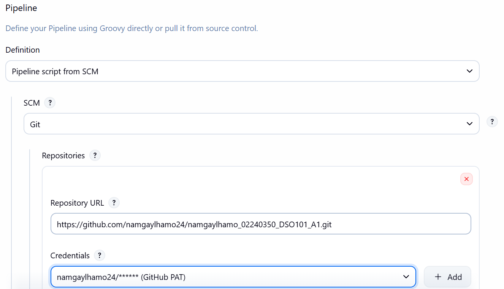
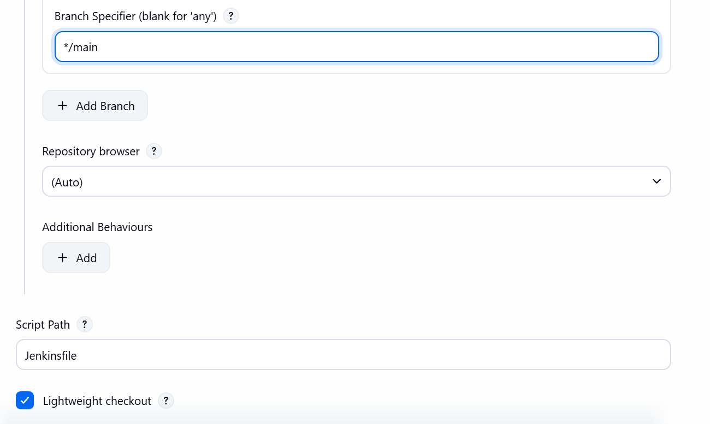
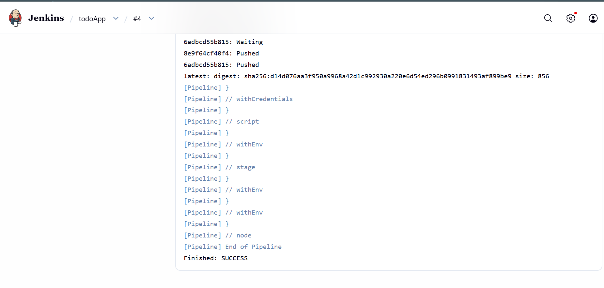
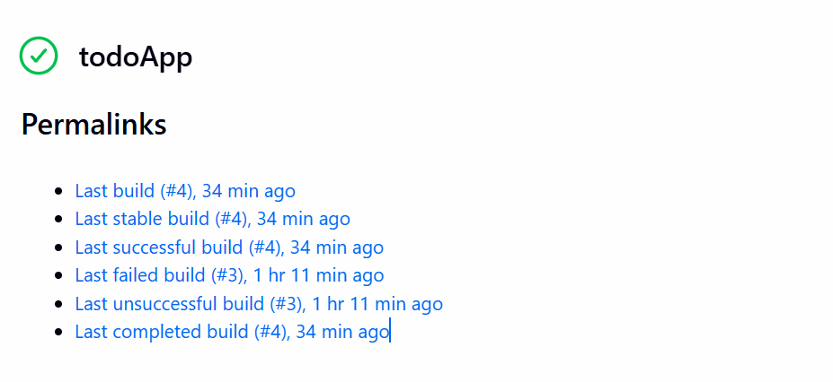
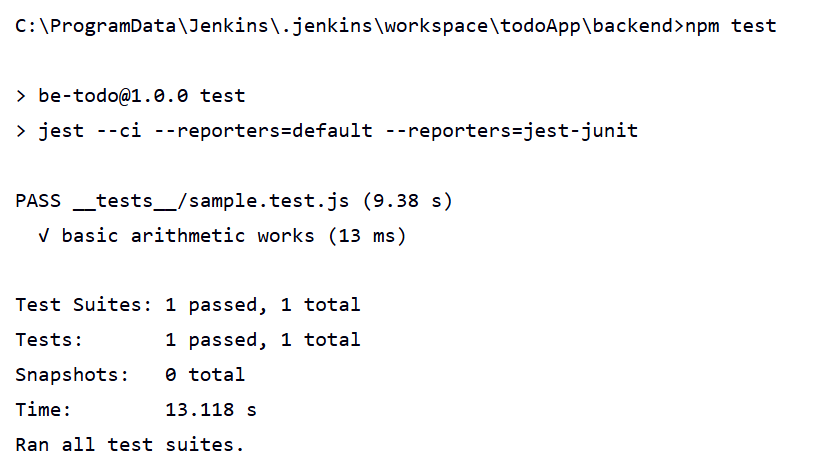
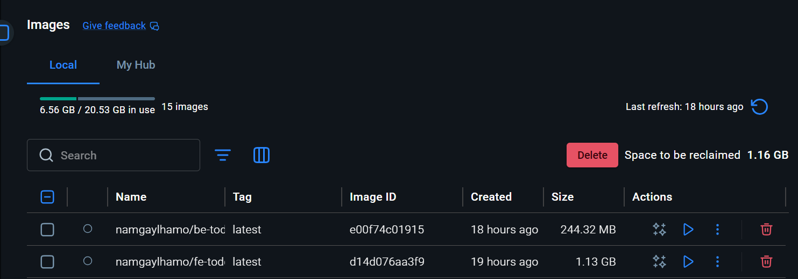

# DSO101 Assignment 2 - CI/CD Pipeline with Jenkins

## Overview
This assignment configures a Jenkins pipeline to automate the build, test, and deployment of a To-Do List application using Docker and GitHub.

---

## Pipeline Stages
1. **Checkout** - Pulls the latest code from GitHub
2. **Clean Checkout** - Ensures workspace is fresh
3. **Install Backend** - Runs `npm install` in the backend folder
4. **Install Frontend** - Runs `npm install` in the frontend folder
5. **Build Frontend** - Builds the React app using `npm run build`
6. **Test Backend** - Runs Jest unit tests and publishes JUnit results
7. **Test Frontend** - Runs frontend tests
8. **Deploy** - Builds Docker images and pushes to Docker Hub

---

## Tools & Technologies
| Tool | Purpose |
|------|---------|
| Jenkins | CI/CD automation |
| GitHub | Source code hosting |
| Node.js & npm | JavaScript runtime & package management |
| Jest & jest-junit | Testing framework & JUnit report generation |
| Docker | Containerization |
| Docker Hub | Image registry |
| Render.com | Cloud deployment |

---

## How I Configured the Pipeline

### 1. Jenkins Setup
- Installed Jenkins on localhost:8080
- Installed required plugins: NodeJS, Pipeline, GitHub Integration, Docker Pipeline, JUnit

### 2. GitHub Repository
- Pushed the to-do app to GitHub
- Generated a Personal Access Token (PAT) with `repo` and `admin:repo_hook` scopes
- Added GitHub credentials to Jenkins as `github-creds`


### 3. Docker Hub
- Created a Docker Hub account
- Generated an access token with Read & Write permissions
- Added Docker Hub credentials to Jenkins as `docker-hub-creds`

### 4. Jenkinsfile
- Created a `Jenkinsfile` in the repo root
- Configured all 8 pipeline stages
- Used `bat` commands instead of `sh` since Jenkins runs on Windows
- Added retry logic for Docker push to handle network instability

```groovy
pipeline {
    agent any
    tools {
        nodejs 'NodeJs'
    }
    stages {

        stage('Checkout') {
            steps {
                git branch: 'main',
                    url: 'https://github.com/namgaylhamo24/namgaylhamo_02240350_DSO101_A1.git',
                    credentialsId: 'github-creds'
            }
        }

        stage('Clean Checkout') {
            steps {
                bat 'git reset --hard'
                bat 'git clean -fdx'
                bat 'git fetch --all'
                bat 'git checkout main'
                bat 'git pull origin main'
            }
        }

        stage('Install Backend') {
            steps {
                dir('backend') {
                    bat 'npm install'
                }
            }
        }

        stage('Install Frontend') {
            steps {
                dir('frontend') {
                    bat 'npm install'
                }
            }
        }

        stage('Build Frontend') {
            steps {
                dir('frontend') {
                    bat 'npm run build'
                }
            }
        }

        stage('Test Backend') {
            steps {
                dir('backend') {
                    bat 'npm test'
                }
            }
            post {
                always {
                    junit 'backend/junit.xml'
                }
            }
        }

        stage('Test Frontend') {
            steps {
                dir('frontend') {
                    bat 'npm test'
                }
            }
        }

        stage('Deploy') {
            steps {
                script {
                    withCredentials([usernamePassword(credentialsId: 'docker-hub-creds', usernameVariable: 'DOCKER_USER', passwordVariable: 'DOCKER_PASS')]) {
                        bat 'docker --version'
                        bat "docker build -t namgaylhamo/be-todo:latest ./backend"
                        bat "docker build -t namgaylhamo/fe-todo:latest ./frontend"
                        bat "docker login -u %DOCKER_USER% -p %DOCKER_PASS% https://index.docker.io/v1/"
                        bat '''
set RETRIES=3
set COUNT=0
:push_be
docker push namgaylhamo/be-todo:latest && goto push_be_ok
set /a COUNT=%COUNT%+1
if %COUNT% lss %RETRIES% goto push_be
exit 1
:push_be_ok

set RETRIES=3
set COUNT=0
:push_fe
docker push namgaylhamo/fe-todo:latest && goto push_fe_ok
set /a COUNT=%COUNT%+1
if %COUNT% lss %RETRIES% goto push_fe
exit 1
:push_fe_ok
'''
                    }
                }
            }
        }
    }
}
```

### 5. Jest Configuration
- Installed `jest` and `jest-junit` in the backend
- Configured `package.json` test script:
```json
"test": "jest --ci --reporters=default --reporters=jest-junit"
```

---

## Screenshots

### Successful Pipeline Execution



### Test Results in Jenkins


### Docker Hub Images


---

## Challenges Faced

### 1. Windows Compatibility
Jenkins runs on Windows, so all `sh` commands had to be replaced with `bat` commands in the Jenkinsfile.

### 2. Node.js Tool Name Mismatch
Jenkins configured the NodeJS tool as `NodeJs` but the Jenkinsfile referenced `NodeJS`, causing a build failure. Fixed by matching the exact name.

### 3. Database Connection on Render
The backend used `DB_HOST=localhost` which doesn't work in a cloud environment. Fixed by creating a Render PostgreSQL database and updating the environment variables.

### 4. Docker Hub Authentication
The initial Docker Hub token had insufficient scopes. Fixed by generating a new token with **Read & Write** permissions.

### 5. Network Instability During Docker Push
The large frontend image (230MB+) caused the push to fail due to connection drops. Fixed by adding retry logic in the Jenkinsfile and a `.dockerignore` file to reduce image size.

### 6. Duplicate Environment Variables
Used both manual entry and "Add from .env" in Render, causing duplicate key errors. Fixed by deleting duplicates and keeping only one set.

---
